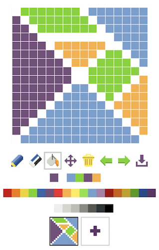

# Pixelm [](https://travis-ci.org/shuhei/pixelm)

A pixel art editor written in Elm

## Features

- Usable on mobile devices
- Tools: pencil, eraser, bucket, move, clear
- Undo
- Animation
- Export to PNG, GIF and animated GIF



## Development

Install:

```sh
npm install
elm-package install

cd tests
elm-package install
```

Start dev server:

```sh
npm start
```

Run unit tests:

```sh
npm test
```

Build assets for production:

```sh
npm build
```

Deploy to GitHub Pages:

```sh
npm run deploy
```

This project is bootstrapped with [Create Elm App](https://github.com/halfzebra/create-elm-app). Check out [its README template](https://github.com/halfzebra/create-elm-app/blob/master/template/README.md) for the structure of this project.
